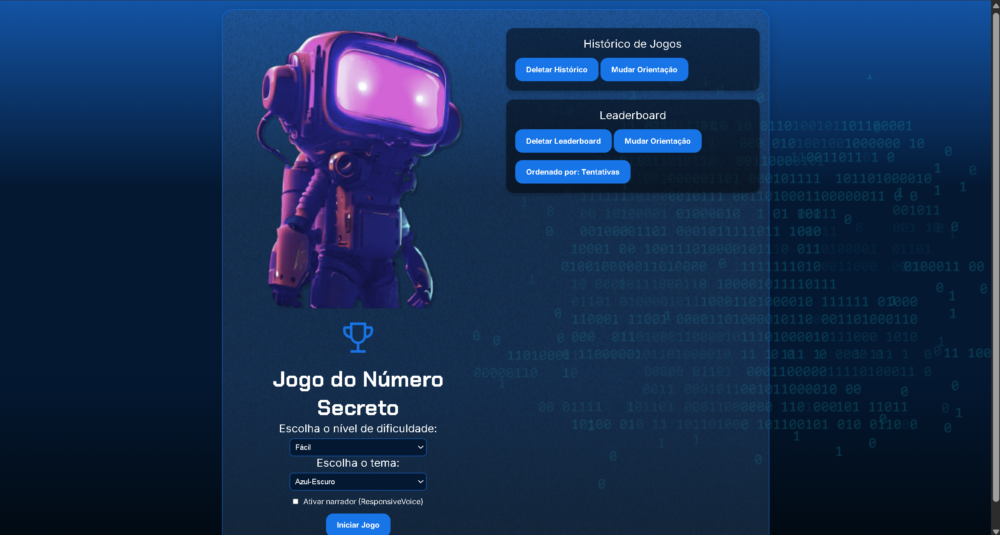

# 🎮 Jogo do Número Secreto

[](https://www.w3.org/html/)
[](https://www.w3.org/Style/CSS/)
[](https://www.ecma-international.org/)

<p align="center">
  
</p>

## 📝 Descrição

O Jogo do Número Secreto é um projeto interativo e divertido onde os jogadores tentam adivinhar um número aleatório. Com uma interface moderna e recursos de acessibilidade, o jogo oferece uma experiência única para todos os usuários.

## ✨ Funcionalidades

- 🎯 Geração aleatória de números
- 🎨 Temas personalizáveis (Azul-Escuro e Roxo)
- 🔊 Narrador de voz (ResponsiveVoice)
- ⏱️ Temporizador para cada partida
- 📊 Histórico de tentativas
- 💾 Registro de jogos anteriores

## 🎨 Interface

<p align="center">
  
</p>

## 🚀 Como Jogar

1. Clone este repositório:
```bash
git clone https://github.com/daviturnesv/ONE_numeroSecreto#
```

2. Abra o arquivo `index.html` em seu navegador

3. Escolha suas preferências:
   - Selecione o tema desejado
   - Ative ou desative o narrador

4. Clique em "Iniciar Jogo"

5. Digite seu palpite e tente adivinhar o número secreto!

## 🛠️ Tecnologias Utilizadas

- HTML5
- CSS3
- JavaScript (ES6+)
- ResponsiveVoice (para narração)

## 🎯 Recursos Especiais

### Temas Personalizáveis
Escolha entre os temas Azul-Escuro e Roxo para uma experiência visual personalizada.

### Narrador de Voz
Recurso de acessibilidade que narra as ações e resultados do jogo.

### Histórico de Jogos
Acompanhe seu desempenho com um registro completo das partidas anteriores.

## 📱 Responsividade

O jogo é totalmente responsivo e pode ser jogado em diferentes dispositivos:
- 💻 Desktop
- 📱 Tablet
- 📱 Smartphone

## 🤝 Contribuição

Contribuições são sempre bem-vindas! Sinta-se à vontade para:

1. Fazer um Fork do projeto
2. Criar uma Branch para sua Feature (`git checkout -b feature/AmazingFeature`)
3. Commit suas mudanças (`git commit -m 'Add some AmazingFeature'`)
4. Push para a Branch (`git push origin feature/AmazingFeature`)
5. Abrir um Pull Request

---

<p align="center">Desenvolvido com 💙 como parte do programa ONE - Oracle Next Education</p>